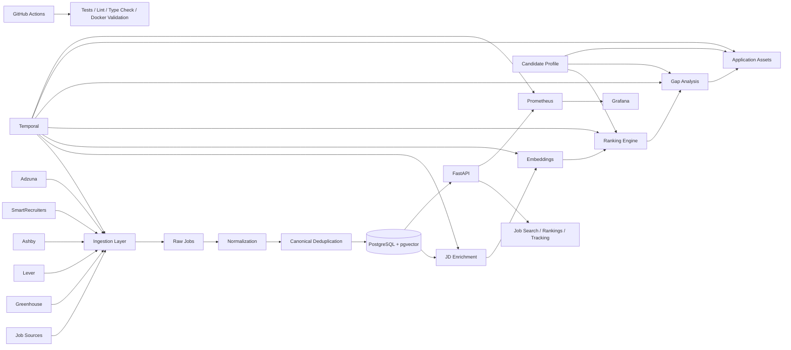

# Job Intelligence

Private AI-powered job intelligence and application orchestration platform for discovering, ranking, enriching, and tracking job opportunities.

The system combines deterministic data engineering workflows with AI-assisted enrichment and matching. It ingests jobs from multiple sources, normalizes and deduplicates them, enriches job descriptions, scores opportunities against a candidate profile, generates application assets, and orchestrates the full pipeline with Temporal.

---

## Why this project

Job discovery is usually fragmented across job boards, ATS pages, recruiter posts, and company career sites.

This project centralizes that workflow into a reproducible data platform with:

- multi-source job ingestion
- canonical deduplication
- provenance and lineage
- semantic job matching
- deterministic eligibility filters
- JD enrichment
- gap analysis
- application asset generation
- workflow orchestration
- observability
- application tracking
- CI/CD and containerized deployment

The goal is not simply to scrape jobs, but to build a reliable decision-support system around the job search process.

---

## Architecture



---

## Core Features

### Multi-source job discovery

Current sources include Greenhouse, Lever, Ashby, SmartRecruiters, and Adzuna. The system prefers structured ATS/API ingestion where available and maintains source provenance for every job record.

### Canonical job deduplication

Jobs from different sources can represent the same opening. The system creates canonical job identities and stores source mappings separately so duplicate jobs are merged without losing provenance.

### Data lineage and provenance

The platform stores source, external identifier, source URL, first/last seen timestamps, source update timestamp, canonical identity, raw source records, and pipeline run history.

### Candidate profile matching

Ranking combines deterministic rules with semantic similarity, including location checks, experience constraints, role relevance, skill matching, embeddings, profile-to-job similarity, and gap analysis.

Jobs can be grouped into:
- high confidence
- discovery
- stretch

### Embeddings and semantic search

Sentence Transformers and pgvector are used to generate and persist job embeddings for semantic matching between candidate profiles, job descriptions, skills, and role requirements.

The Docker image installs CPU-only PyTorch to keep the runtime significantly smaller than a CUDA-enabled build.

### Job description enrichment

Job descriptions are parsed into structured information such as required skills, preferred skills, technologies, experience requirements, responsibilities, and job metadata.

### Gap analysis

The system compares the candidate profile against enriched job requirements to identify matched skills, missing skills, transferable skills, experience gaps, and areas to emphasize in an application.

### Application assets

The platform can generate job-specific outreach, recruiter messages, gap summaries, application notes, and job-specific positioning.

### Application tracking

Application state and history are persisted across stages such as discovered, shortlisted, applied, interviewing, rejected, offer, and archived.

---

## Workflow Orchestration

Temporal manages the end-to-end pipeline:

1. source ingestion
2. normalization
3. persistence
4. job lifecycle updates
5. enrichment
6. embedding generation
7. ranking
8. gap analysis
9. application asset generation
10. notification delivery
11. pipeline finalization

Temporal provides retries, durable execution, workflow history, activity isolation, failure recovery, and task queue management.

Primary task queue:

```text
job-intelligence-pipeline
```

---

## API

The FastAPI service exposes endpoints for health checks, jobs, rankings, shortlist views, job state, application history, pipeline execution, Temporal workflow status, statistics, and Prometheus metrics.

Local API:

```text
http://localhost:8000
```

Interactive docs:

```text
http://localhost:8000/docs
```

Health check:

```bash
curl http://127.0.0.1:8000/health
```

---

## Observability

### Prometheus

```text
http://localhost:9090
```

Targets:
- jobintel-api
- jobintel-temporal-worker
- prometheus

### Grafana

```text
http://localhost:3000
```

Metrics cover API requests, latency, response status, worker availability, and Temporal pipeline finalizations.

---

## Technology Stack

### Core
- Python 3.13
- FastAPI
- SQLAlchemy
- PostgreSQL
- pgvector
- Alembic

### Workflow orchestration
- Temporal
- Temporal Python SDK

### AI / semantic matching
- Sentence Transformers
- PyTorch CPU
- pgvector
- OpenAI API
- Groq API

### Data ingestion
- HTTPX
- ATS APIs
- Adzuna API

### Observability
- Prometheus
- Grafana
- structured JSON logging

### Quality and CI/CD
- Pytest
- Ruff
- Black
- Mypy
- pre-commit
- GitHub Actions
- Docker
- Docker Compose

---

## Project Structure

```text
job-intelligence/
|
|-- .github/
|   `-- workflows/
|-- migrations/
|-- observability/
|   |-- grafana/
|   `-- prometheus/
|-- profiles/
|-- src/
|   `-- jobintel/
|-- tests/
|-- .env.example
|-- alembic.ini
|-- docker-compose.yml
|-- Dockerfile
|-- pyproject.toml
`-- README.md
```

---

## Running with Docker

### 1. Clone

```bash
git clone https://github.com/ken-kaneki21/job-portal.git
cd job-portal
```

### 2. Create local environment configuration

Windows:

```bat
copy .env.example .env
```

Linux/macOS:

```bash
cp .env.example .env
```

Add credentials only for integrations you intend to use. Do not commit `.env`.

### 3. Start the platform

```bash
docker compose up -d --build
```

Docker Compose starts PostgreSQL + pgvector, Temporal PostgreSQL, Temporal Server, Temporal UI, the migration job, FastAPI, the Temporal worker, Prometheus, and Grafana.

### 4. Verify

```bash
docker compose ps
curl http://127.0.0.1:8000/health
curl http://127.0.0.1:9101/metrics
```

---

## Service Ports

| Service | Port |
|---|---:|
| FastAPI | 8000 |
| Temporal | 7233 |
| Temporal UI | 8080 |
| PostgreSQL | 55432 |
| Prometheus | 9090 |
| Temporal worker metrics | 9101 |
| Grafana | 3000 |

---

## Running Locally Without Docker

Windows:

```bat
python -m venv .venv
.venv\Scripts\activate
```

Install:

```bash
pip install -e ".[dev]"
```

Start infrastructure:

```bash
docker compose up -d postgres temporal-postgres temporal temporal-ui
```

Run migrations:

```bash
alembic upgrade head
```

Start API:

```bash
python -m uvicorn jobintel.api:app --host 0.0.0.0 --port 8000
```

Start worker in another terminal:

```bash
python -m jobintel.temporal_pipeline.worker
```

---

## Running the Pipeline

Start a Temporal-managed pipeline run:

```bash
curl -X POST http://127.0.0.1:8000/pipeline/run-temporal
```

Check workflow status:

```bash
curl http://127.0.0.1:8000/temporal/workflows/<workflow_id>
```

---

## Testing

```bash
pytest -q
```

Current baseline:

```text
134 passed
```

Static checks:

```bash
ruff check src tests
black --check src tests
mypy src/jobintel
```

---

## Database Migrations

```bash
alembic current
alembic upgrade head
alembic revision --autogenerate -m "description"
```

---

## CI/CD

GitHub Actions validates every push with two primary jobs.

### Quality and Tests
- dependency installation
- Ruff
- Black
- Mypy
- Alembic migration validation
- Pytest

### Docker Validation
- Docker Compose configuration validation
- application Docker image build

---

## Security and Privacy

The project is designed as a private personal job-search platform.

Practices include:
- secrets outside source control
- `.env` excluded from Git
- `.env.example` contains placeholders only
- structured data provenance
- local/private deployment support
- no requirement to expose the API publicly

Never commit API keys, email credentials, non-development database passwords, or private profile data.

---

## Engineering Goals

The project emphasizes deterministic behavior where rules are sufficient, AI where semantic reasoning adds value, reproducibility, idempotency, explicit provenance, durable workflows, testability, observability, privacy, and modular pipelines.

---

## Current Status

Validated capabilities include:

- multi-source ingestion
- canonical deduplication
- provenance tracking
- lifecycle management
- embeddings
- job enrichment
- ranking
- gap analysis
- application asset generation
- Temporal orchestration
- application state tracking
- FastAPI
- Prometheus
- Grafana
- Docker Compose
- database migrations
- GitHub Actions CI

Current automated test baseline:

```text
134 passed
```

---

## Future Enhancements

Potential future work:
- learning-to-rank using application outcomes
- richer recruiter outreach workflows
- automated company intelligence
- news and company signals
- additional ATS integrations
- configurable LLM providers
- UI/dashboard layer
- cloud deployment
- scheduled pipeline execution
- expanded evaluation datasets

---

## License

This project is currently intended for personal and portfolio use.
